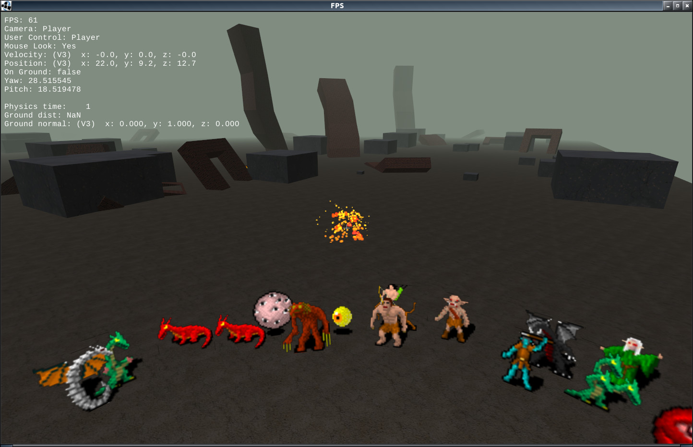

#GDX-Proto - A lightweight 3D engine built with [libgdx](http://libgdx.badlogicgames.com)



---------------

###GDX-Proto is immature. Breaking changes are to be expected. Code might be a bit messy before it gets a nice refactoring.

-----------

GDX-Proto is a lightweight 3d engine built with two main objectives:
- Provide an open source codebase showing how to do many basic and essential things for 3d games with [libgdx](http://libgdx.badlogicgames.com), a cross-platform Java game framework.
- Provide a simple, extensible 3d engine that takes care of lower-level things such as physics and networking.

While the current version is implemented as a First Person Shooter (FPS) demo, the code is highly adaptable for other uses, without too much work.

## Overview of Features

### Graphics
- Basic 3d rendering using a slightly modified version of the default libgdx 3d shader. It takes advantage of the new libgdx 3D API.
- 3D Particle system based on the new libgdx 3d particle system (version 1.2.1+, not included in 1.2.0)

### Physics
- The Bullet physics library is used for collision detection, but not for collision resolution.  This allows for fast and efficient collision detection without the performance penalties of a fully simulated bullet world.  A default collision resolution system is included in the Physics class, but it can be modifided to suit your needs.
- Raycasting for projectile hit detection 

### Networking
- Supports local or online play
- KryoNet based
- Mix of TCP and UDP where appropriate
- Entity interpolation
- Client prediction (for movement only, not yet implemented for projectiles)
- Simple chat system
- Supports libgdx headless backend for creating a headless server, such as on a VPS
- Server transmits level geometry to client upon connection
- "The server is the man": Most logic is run server-side to prevent cheats or hacking.

### Other
- Basic Entity system with DynamicEntities, represented by either Decals (Billboard sprites) or 3D models
- Movement component class handles acceleration, velocity, position, rotation, max speeds
- Subclasses of Movement: GroundMovement and FlyingMovement
- Optional logging to file, see Log class
- 

### Using GDX-Proto For Your Own Projects
Currentyl, GDX-Proto does not exist as a library.  The best way to use it for your own project is to use it as a base for a new project, and remove parts you do not wish, while adding your own code on top.  In the future it may be modified to be more convenient.

## Demo - First Person Shooter
**A pre-built jar of the [desktop demo can be downloaded here](https://github.com/jrenner/gdx-proto/blob/master/bin/fps-demo.jar?raw=true).**
To play a simple local, singleplayer demo run the `desktop:run` gradle task
There are also many command line options available, such as setting screen size, starting a server, choosing what hostname to connect to, etc. To see a full list:
Run the `desktop:dist` gradle task to create the desktop jar.
the desktop jar file should be located in: `desktop/build/libs`
Then run the desktop jar with the command argument `-h` or `--help`

To start a local, non-networked single-player demo:
`java -jar desktop.jar`
To start a server:
`java -jar desktop.jar -s`
To start a server and connect to it yourself:
`java -jar desktop.jar -s -c`
To connect to an online server, www.example.com, port 19000:
`java -jar desktop.jar -c -a "www.example.com" -p 19000`

If you wish to run a headless server, run the `:headless:dist` gradle task, and run:
`java -jar headless.jar -s`

Here is an example usage output, but for a more up-to-date version run -h on the command line.
```
 -a,--address <arg>      supply hostname address to connect to
 -c,--client             connect to server as a client
 -d,--lag-delay <arg>    simulate lag with argument = milliseconds of lag
 -h,--help               print help
 -p,--port <arg>         specify TCP port to either host on (server) or
                         connect to (client)
 -s,--server             start online server
 -z,--screensize <arg>   suppley screen size in the form of WIDTHxHEIGHT,
                         i.e. 1920x1080
```

## Contributions
Contributions are welcome! If you have a large contribution you wish to make, make an issue first for discussion to make sure it's something that could be included in the project.

## TODO
- Profile and improve networking
- General refactoring, check all disposables are disposed (avoid memory leaks)
- Implement frustum and distance culling

## License
Apache 2.0
